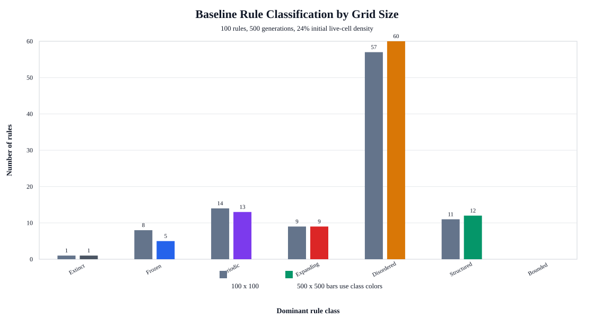
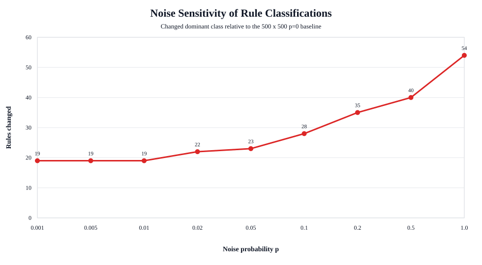

# Cellular Automata Rule-Space Report

## Overview

This project studies two-dimensional binary cellular automata using Moore neighborhoods and outer-totalistic `B/S` rules. A rule is written as `B.../S...`: the birth set gives the neighbor counts that turn a dead cell alive, and the survival set gives the neighbor counts that keep a live cell alive.

The website implements an interactive simulator for Conway's Game of Life, HighLife, and arbitrary `B/S` rules. The recorded experiments extend the interactive work into a 100-rule rule-space study and a noise/perturbation sweep.

## Simulator Implementation

The simulator stores the grid as a flat `Uint8Array(n * n)` and renders it to a `<canvas>`. This avoids creating one DOM element per cell and keeps large grids responsive. The interface exposes:

- Grid sizes: 50 x 50, 100 x 100, 200 x 200, and 300 x 300.
- Rule controls: checkboxes for each birth count and survival count from 0 through 8.
- Standard controls: randomize, clear, step, run/pause, density, speed, and wrapping.
- A displayed rule string such as `B3/S23` or `B36/S23`.

The headless studies use the same rule representation but run outside the browser so many trials can be recorded consistently.

## Experimental Procedure

### Rule Set

The study used 100 rules:

- Conway's Game of Life: `B3/S23`
- HighLife: `B36/S23`
- 98 seeded random outer-totalistic rules

The random rule set was generated from seed `202609`, so the same 100 rules can be regenerated by the scripts in the repository.

### Baseline Study

The first baseline study used:

| Parameter | Value |
| --- | ---: |
| Rules | 100 |
| Trials per rule | 10 |
| Steps per trial | 500 |
| Grid size | 100 x 100 |
| Initial live-cell density | 24% |
| Boundary condition | Wrapped torus |
| Seed | 202609 |

Each rule was classified by its distribution over the ten random initial conditions. The dominant class was the most frequent class among those trials.

### Large-Grid Study

The follow-up study reran the same 100 rules on a 500 x 500 grid:

| Parameter | Value |
| --- | ---: |
| Rules | 100 |
| Trials per rule | 1 |
| Steps per trial | 500 |
| Grid size | 500 x 500 |
| Initial live-cell density | 24% |
| Boundary condition | Wrapped torus |
| Seed | 202609 |

This run was used to check whether classifications changed when finite-size effects were reduced. Because this run used one trial per rule, it is best interpreted as an exploratory comparison against the 100 x 100, 10-trial baseline.

### Noise and Perturbations

For the perturbation experiment, each cell was flipped independently after every rule update with probability `p`. The tested values were:

`p = 0, 0.001, 0.005, 0.01, 0.02, 0.05, 0.1, 0.2, 0.5, 1.0`

For a given rule and trial, the same starting grid was reused at every noise probability. That makes the comparison focus on perturbation strength rather than on a different random initial condition.

## Measurements

For each simulation, the scripts measured:

- Density: `rho_t = live cells / N^2`
- Activity: `A_t = changed cells / N^2`
- Occupied area: bounding-box area containing all live cells, divided by `N^2`
- State repetition: hash table of whole-grid states, used to detect fixed points and periodicity
- Density and area trends: late-window averages minus early-window averages
- Center-of-mass shift: movement proxy for possible mobile behavior

The early and late windows each cover one fifth of the run, with a minimum of 20 steps.

## Classification Procedure

Each run was classified with a priority-ordered decision rule:

1. **Extinct**: no live cells remain.
2. **Frozen**: nonzero live cells remain, but final activity is approximately zero, or the repeated state has period 1.
3. **Periodic**: a previous whole-grid hash repeats with period greater than 1.
4. **Expanding**: occupied area or density increases strongly, or the rule reaches very high-density active behavior.
5. **Disordered**: late activity and late density are both high.
6. **Structured Dynamic**: activity persists, but density or occupied area remains lower than the disordered regime.
7. **Bounded Dynamic**: low but nonzero persistent activity without meeting the previous criteria.

The implementation thresholds were:

- Frozen if final activity is at most one cell change, or if repeat period is 1.
- Expanding if area trend is greater than `0.12`, density trend is greater than `0.08`, or late density is above `0.65` with late activity above `0.08`.
- Disordered if late activity is above `0.12` and late density is above `0.35`.
- Structured Dynamic if late activity is above `0.01` and either late occupied area is below `0.65` or late density is below `0.35`.
- Mobile tag if center-of-mass shift is above `0.12`, late activity is above `0.005`, and late occupied area is below `0.65`.

Reproductive behavior was not assigned automatically. Detecting self-reproduction reliably would require pattern-level recognition, so it should be checked visually for candidate rules rather than inferred from these aggregate statistics alone.

## Results

### Baseline Classification



| Class | 100 x 100 rules | 500 x 500 rules |
| --- | ---: | ---: |
| Extinct | 1 | 1 |
| Frozen | 8 | 5 |
| Periodic | 14 | 13 |
| Expanding | 9 | 9 |
| Disordered | 57 | 60 |
| Structured Dynamic | 11 | 12 |
| Bounded Dynamic | 0 | 0 |

The overall class distribution was similar at the two grid sizes. Disordered rules were the largest group in both runs. Increasing the grid from 100 x 100 to 500 x 500 changed the dominant classification for 7 of the 100 rules:

| Rule | 100 x 100 class | 500 x 500 class |
| --- | --- | --- |
| `B1578/S035678` | Frozen | Periodic |
| `B056/S1278` | Periodic | Structured Dynamic |
| `B234/S2345` | Periodic | Disordered |
| `B237/S0134567` | Periodic | Disordered |
| `B2457/S1235678` | Frozen | Periodic |
| `B17/S2348` | Periodic | Disordered |
| `B13568/S015678` | Frozen | Periodic |

Conway's Life and HighLife both remained **Structured Dynamic** at 100 x 100 and 500 x 500. At 500 x 500 with no noise, Conway Life had average final density `0.054` and average late activity `0.036`; HighLife had average final density `0.044` and average late activity `0.032`.

### Noise Sensitivity



| Noise probability | Rules whose dominant class changed from `p=0` |
| --- | ---: |
| 0.001 | 19 |
| 0.005 | 19 |
| 0.010 | 19 |
| 0.020 | 22 |
| 0.050 | 23 |
| 0.100 | 28 |
| 0.200 | 35 |
| 0.500 | 40 |
| 1.000 | 54 |

Even very small noise changed a noticeable subset of rules. At `p=0.001`, 19 rules changed class. Most of these early changes came from previously Frozen or Periodic rules becoming Bounded Dynamic, Structured Dynamic, or Disordered. This is expected: a tiny rate of random flips can prevent exact state repetition, so periodic and frozen classifications are especially fragile under noise.

At `p=0.5`, all 100 rules were classified as Disordered. This is the clearest perturbation result: when every cell has a 50% chance of being flipped after each update, the rule dynamics are overwhelmed by noise and the grid approaches high-activity random behavior.

The `p=1.0` case is special. It is not random noise in the usual sense; every cell is flipped after every update. This produces deterministic complement dynamics, so the classifications spread back across Frozen, Periodic, Expanding, Disordered, Structured Dynamic, and Bounded Dynamic rather than remaining all Disordered.

### Class Distribution Across Noise Values


| Noise | Extinct | Frozen | Periodic | Expanding | Disordered | Structured Dynamic | Bounded Dynamic |
| --- | ---: | ---: | ---: | ---: | ---: | ---: | ---: |
| 0.000 | 1 | 5 | 13 | 9 | 60 | 12 | 0 |
| 0.001 | 0 | 0 | 0 | 10 | 65 | 13 | 12 |
| 0.005 | 0 | 0 | 0 | 10 | 67 | 15 | 8 |
| 0.010 | 0 | 0 | 0 | 10 | 71 | 19 | 0 |
| 0.020 | 0 | 0 | 0 | 11 | 70 | 19 | 0 |
| 0.050 | 0 | 0 | 0 | 13 | 69 | 18 | 0 |
| 0.100 | 0 | 0 | 0 | 11 | 74 | 15 | 0 |
| 0.200 | 0 | 0 | 0 | 3 | 87 | 10 | 0 |
| 0.500 | 0 | 0 | 0 | 0 | 100 | 0 | 0 |
| 1.000 | 0 | 5 | 17 | 13 | 60 | 4 | 1 |

The grouped histogram shows a sharp loss of exact Extinct, Frozen, and Periodic outcomes as soon as small stochastic perturbations are introduced. The middle range of noise shifts the rule set toward Disordered classifications. Structured Dynamic behavior persists for some rules through moderate noise, but it declines as `p` approaches `0.5`.

### Conway Life and HighLife Under Noise

| Noise | Conway Life class | Conway density | Conway activity | HighLife class | HighLife density | HighLife activity |
| --- | --- | ---: | ---: | --- | ---: | ---: |
| 0.000 | Structured Dynamic | 0.054 | 0.036 | Structured Dynamic | 0.044 | 0.032 |
| 0.001 | Structured Dynamic | 0.075 | 0.061 | Structured Dynamic | 0.059 | 0.054 |
| 0.005 | Structured Dynamic | 0.086 | 0.078 | Structured Dynamic | 0.121 | 0.116 |
| 0.010 | Structured Dynamic | 0.136 | 0.129 | Structured Dynamic | 0.194 | 0.194 |
| 0.020 | Structured Dynamic | 0.232 | 0.229 | Structured Dynamic | 0.279 | 0.285 |
| 0.050 | Structured Dynamic | 0.319 | 0.327 | Structured Dynamic | 0.348 | 0.365 |
| 0.100 | Disordered | 0.359 | 0.377 | Disordered | 0.386 | 0.409 |
| 0.200 | Disordered | 0.403 | 0.426 | Disordered | 0.420 | 0.451 |
| 0.500 | Disordered | 0.499 | 0.500 | Disordered | 0.498 | 0.500 |
| 1.000 | Frozen | 1.000 | 0.000 | Periodic | 0.993 | 0.000 |

Both Conway Life and HighLife were robustly classified as Structured Dynamic through `p=0.05`. At `p=0.1`, both crossed into Disordered behavior. The density and activity values show why: the perturbations raise the live-cell density and changed-cell fraction until localized structures are no longer the dominant behavior.

## Interpretation

The main conclusion is that measurement-based classes can separate several broad regimes: extinction, stability, periodicity, expansion, disorder, and structured dynamics. However, the boundary between Structured Dynamic and Disordered is quantitative and threshold-dependent. Rules near that boundary should be rerun with more initial conditions and longer simulations before being treated as final examples.

The 500 x 500 baseline suggests that most classifications are not purely small-grid artifacts: 93 of 100 rules kept the same dominant class. The seven changes are still important because they show that Frozen and Periodic labels can be sensitive to grid size and initial-condition sampling.

Noise affects exact classifications most strongly for Frozen and Periodic rules, because random flips disrupt exact rest states and exact cycle repeats. Conway Life and HighLife are more robust: they remain Structured Dynamic under low and moderate perturbation, then become Disordered once noise is large enough to dominate local structure.

## Interesting Questions

1. **Attractor counting:** How does the number of fixed and period-`k` configurations of a Life-like rule scale with grid size, and can they be counted efficiently?
2. **Emergence thresholds:** Given that such structures are possible, under what density and spatial-isolation conditions do they actually emerge from random initial conditions? Is there a predictable finite-size or critical threshold?

## Limitations

- The 100 x 100 baseline used 10 trials per rule, but the 500 x 500 noise sweep used one trial per rule/probability.
- The classifier uses whole-grid hashes for periodicity, so local oscillators inside noisy backgrounds are not counted as Periodic.
- The Mobile tag is only a center-of-mass proxy and did not identify reliable mobile or reproductive behavior in the recorded runs.
- Reproduction was not automatically detected.
- Longer runs may change classifications for slow-growing, slowly stabilizing, or rare-structure rules.

## Reproducibility

Run the browser simulator by opening `index.html`, or serve the project locally with:

```sh
python3 -m http.server 8080
```

Reproduce the 100 x 100 baseline:

```sh
node scripts/run_task3_study.js
```

Reproduce the 500 x 500 baseline and noise sweep:

```sh
clang++ -std=c++17 -O3 -pthread scripts/run_large_noise_study.cpp -o /tmp/run_large_noise_study
/tmp/run_large_noise_study
```

Regenerate report figures:

```sh
python3 scripts/plot_noise_classification_histogram.py
python3 scripts/plot_report_figures.py
```

The raw results are stored in `results/`.
