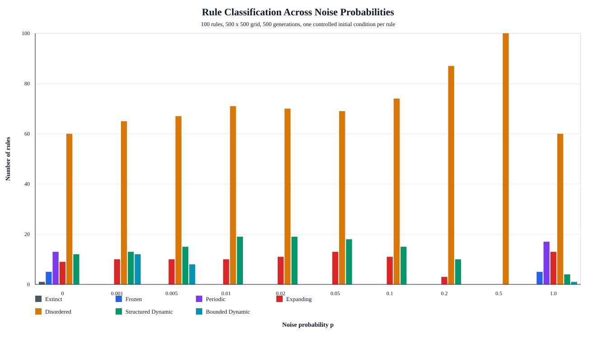

# 500 x 500 Rule Study and Noise Sweep

Generated: 2026-09-07T23:43:53Z

## Configuration

- Rules: 100 (Conway Life, HighLife, and 98 seeded random rules)
- Trials per rule per noise value: 1
- Steps per trial: 500
- Grid: 500 x 500
- Initial density: 24%
- Edge handling: wrapped torus
- Seed: 202609
- Initial-state control: each rule/trial starts from the same grid at every noise probability
- Noise probabilities: 0.000, 0.001, 0.005, 0.010, 0.020, 0.050, 0.100, 0.200, 0.500, 1.000
- Runtime: 56.3 seconds

## 500 x 500 Baseline Classes

- Extinct: 1 rules
- Frozen: 5 rules
- Periodic: 13 rules
- Expanding: 9 rules
- Disordered: 60 rules
- Structured Dynamic: 12 rules
- Bounded Dynamic: 0 rules

Classification changed from the prior 100 x 100, 10-trial run for 7 of 100 rules.

## Pinned Rules at 500 x 500, No Noise

| Rule label | Rule | Dominant class | Distribution | Avg density | Avg activity |
| --- | --- | --- | --- | --- | --- |
| Conway Life | B3/S23 | Structured Dynamic | Structured Dynamic: 100% | 0.054 | 0.036 |
| HighLife | B36/S23 | Structured Dynamic | Structured Dynamic: 100% | 0.044 | 0.032 |

## Noise Sensitivity

| Noise p | Rules whose dominant class changed from p=0 |
| --- | ---: |
| 0.001 | 19 |
| 0.005 | 19 |
| 0.010 | 19 |
| 0.020 | 22 |
| 0.050 | 23 |
| 0.100 | 28 |
| 0.200 | 35 |
| 0.500 | 40 |
| 1.000 | 54 |

## Grouped Classification Histogram

The plotted counts are also available in `task3_noise_class_counts.csv`.

## Pinned Rule Noise Response

| Noise p | Rule label | Dominant class | Avg density | Avg activity |
| --- | --- | --- | ---: | ---: |
| 0.000 | Conway Life | Structured Dynamic | 0.054 | 0.036 |
| 0.000 | HighLife | Structured Dynamic | 0.044 | 0.032 |
| 0.001 | Conway Life | Structured Dynamic | 0.075 | 0.061 |
| 0.001 | HighLife | Structured Dynamic | 0.059 | 0.054 |
| 0.005 | Conway Life | Structured Dynamic | 0.086 | 0.078 |
| 0.005 | HighLife | Structured Dynamic | 0.121 | 0.116 |
| 0.010 | Conway Life | Structured Dynamic | 0.136 | 0.129 |
| 0.010 | HighLife | Structured Dynamic | 0.194 | 0.194 |
| 0.020 | Conway Life | Structured Dynamic | 0.232 | 0.229 |
| 0.020 | HighLife | Structured Dynamic | 0.279 | 0.285 |
| 0.050 | Conway Life | Structured Dynamic | 0.319 | 0.327 |
| 0.050 | HighLife | Structured Dynamic | 0.348 | 0.365 |
| 0.100 | Conway Life | Disordered | 0.359 | 0.377 |
| 0.100 | HighLife | Disordered | 0.386 | 0.409 |
| 0.200 | Conway Life | Disordered | 0.403 | 0.426 |
| 0.200 | HighLife | Disordered | 0.420 | 0.451 |
| 0.500 | Conway Life | Disordered | 0.499 | 0.500 |
| 0.500 | HighLife | Disordered | 0.498 | 0.500 |
| 1.000 | Conway Life | Frozen | 1.000 | 0.000 |
| 1.000 | HighLife | Periodic | 0.993 | 0.000 |

## Rules Changed by 500 x 500 Baseline

| Rule label | Rule | 100 x 100 class | 500 x 500 class |
| --- | --- | --- | --- |
| Sample 12 | B1578/S035678 | Frozen | Periodic |
| Sample 23 | B056/S1278 | Periodic | Structured Dynamic |
| Sample 25 | B234/S2345 | Periodic | Disordered |
| Sample 62 | B237/S0134567 | Periodic | Disordered |
| Sample 75 | B2457/S1235678 | Frozen | Periodic |
| Sample 81 | B17/S2348 | Periodic | Disordered |
| Sample 93 | B13568/S015678 | Frozen | Periodic |

## Noise-Caused Changes

| Noise p | Rule label | Rule | p=0 class | Noisy class |
| --- | --- | --- | --- | --- |
| 0.001 | Sample 08 | B36/S06 | Periodic | Bounded Dynamic |
| 0.001 | Sample 12 | B1578/S035678 | Periodic | Expanding |
| 0.001 | Sample 17 | B0123678/S035 | Periodic | Disordered |
| 0.001 | Sample 20 | B378/S01678 | Periodic | Structured Dynamic |
| 0.001 | Sample 22 | B02468/S0245678 | Frozen | Bounded Dynamic |
| 0.001 | Sample 26 | B24/S3456 | Periodic | Bounded Dynamic |
| 0.001 | Sample 30 | B6/S013678 | Frozen | Bounded Dynamic |
| 0.001 | Sample 33 | B03/S3456 | Periodic | Bounded Dynamic |
| 0.001 | Sample 64 | B0123578/S0145 | Periodic | Disordered |
| 0.001 | Sample 67 | B56/S7 | Extinct | Bounded Dynamic |
| 0.001 | Sample 68 | B3478/S067 | Periodic | Bounded Dynamic |
| 0.001 | Sample 72 | B028/S1234578 | Frozen | Bounded Dynamic |
| 0.001 | Sample 75 | B2457/S1235678 | Periodic | Bounded Dynamic |
| 0.001 | Sample 83 | B0123468/S145 | Periodic | Disordered |
| 0.001 | Sample 86 | B568/S016 | Frozen | Bounded Dynamic |
| 0.001 | Sample 89 | B012348/S2346 | Periodic | Disordered |
| 0.001 | Sample 93 | B13568/S015678 | Periodic | Bounded Dynamic |
| 0.001 | Sample 94 | B0235/S0123 | Periodic | Disordered |
| 0.001 | Sample 95 | B568/S0135 | Frozen | Bounded Dynamic |
| 0.005 | Sample 08 | B36/S06 | Periodic | Structured Dynamic |
| 0.005 | Sample 12 | B1578/S035678 | Periodic | Expanding |
| 0.005 | Sample 17 | B0123678/S035 | Periodic | Disordered |
| 0.005 | Sample 20 | B378/S01678 | Periodic | Structured Dynamic |
| 0.005 | Sample 22 | B02468/S0245678 | Frozen | Bounded Dynamic |
| 0.005 | Sample 26 | B24/S3456 | Periodic | Disordered |
| 0.005 | Sample 30 | B6/S013678 | Frozen | Bounded Dynamic |
| 0.005 | Sample 33 | B03/S3456 | Periodic | Disordered |
| 0.005 | Sample 64 | B0123578/S0145 | Periodic | Disordered |
| 0.005 | Sample 67 | B56/S7 | Extinct | Bounded Dynamic |
| 0.005 | Sample 68 | B3478/S067 | Periodic | Structured Dynamic |
| 0.005 | Sample 72 | B028/S1234578 | Frozen | Bounded Dynamic |
| 0.005 | Sample 75 | B2457/S1235678 | Periodic | Bounded Dynamic |
| 0.005 | Sample 83 | B0123468/S145 | Periodic | Disordered |
| 0.005 | Sample 86 | B568/S016 | Frozen | Bounded Dynamic |
| 0.005 | Sample 89 | B012348/S2346 | Periodic | Disordered |
| 0.005 | Sample 93 | B13568/S015678 | Periodic | Bounded Dynamic |
| 0.005 | Sample 94 | B0235/S0123 | Periodic | Disordered |
| 0.005 | Sample 95 | B568/S0135 | Frozen | Bounded Dynamic |
| 0.010 | Sample 08 | B36/S06 | Periodic | Structured Dynamic |
| 0.010 | Sample 12 | B1578/S035678 | Periodic | Expanding |
| 0.010 | Sample 17 | B0123678/S035 | Periodic | Disordered |
| 0.010 | Sample 20 | B378/S01678 | Periodic | Structured Dynamic |
| 0.010 | Sample 22 | B02468/S0245678 | Frozen | Disordered |
| 0.010 | Sample 26 | B24/S3456 | Periodic | Disordered |
| 0.010 | Sample 30 | B6/S013678 | Frozen | Structured Dynamic |
| 0.010 | Sample 33 | B03/S3456 | Periodic | Disordered |
| 0.010 | Sample 64 | B0123578/S0145 | Periodic | Disordered |
| 0.010 | Sample 67 | B56/S7 | Extinct | Structured Dynamic |
| 0.010 | Sample 68 | B3478/S067 | Periodic | Structured Dynamic |
| 0.010 | Sample 72 | B028/S1234578 | Frozen | Disordered |
| 0.010 | Sample 75 | B2457/S1235678 | Periodic | Disordered |
| 0.010 | Sample 83 | B0123468/S145 | Periodic | Disordered |
| 0.010 | Sample 86 | B568/S016 | Frozen | Structured Dynamic |
| 0.010 | Sample 89 | B012348/S2346 | Periodic | Disordered |
| 0.010 | Sample 93 | B13568/S015678 | Periodic | Disordered |
| 0.010 | Sample 94 | B0235/S0123 | Periodic | Disordered |
| 0.010 | Sample 95 | B568/S0135 | Frozen | Structured Dynamic |
| 0.020 | Sample 08 | B36/S06 | Periodic | Structured Dynamic |
| 0.020 | Sample 09 | B1234567/S56 | Disordered | Expanding |
| 0.020 | Sample 12 | B1578/S035678 | Periodic | Expanding |
| 0.020 | Sample 17 | B0123678/S035 | Periodic | Disordered |
| 0.020 | Sample 20 | B378/S01678 | Periodic | Structured Dynamic |
| 0.020 | Sample 22 | B02468/S0245678 | Frozen | Disordered |
| 0.020 | Sample 26 | B24/S3456 | Periodic | Disordered |
| 0.020 | Sample 30 | B6/S013678 | Frozen | Structured Dynamic |
| 0.020 | Sample 33 | B03/S3456 | Periodic | Disordered |
| 0.020 | Sample 62 | B237/S0134567 | Disordered | Expanding |
| 0.020 | Sample 63 | B014568/S2467 | Expanding | Disordered |
| 0.020 | Sample 64 | B0123578/S0145 | Periodic | Disordered |
| 0.020 | Sample 67 | B56/S7 | Extinct | Structured Dynamic |
| 0.020 | Sample 68 | B3478/S067 | Periodic | Structured Dynamic |
| 0.020 | Sample 72 | B028/S1234578 | Frozen | Disordered |
| 0.020 | Sample 75 | B2457/S1235678 | Periodic | Disordered |
| 0.020 | Sample 83 | B0123468/S145 | Periodic | Disordered |
| 0.020 | Sample 86 | B568/S016 | Frozen | Structured Dynamic |
| 0.020 | Sample 89 | B012348/S2346 | Periodic | Disordered |
| 0.020 | Sample 93 | B13568/S015678 | Periodic | Disordered |
| 0.020 | Sample 94 | B0235/S0123 | Periodic | Disordered |
| 0.020 | Sample 95 | B568/S0135 | Frozen | Structured Dynamic |
| 0.050 | Sample 08 | B36/S06 | Periodic | Structured Dynamic |
| ... | ... | ... | ... | ... |

## Interpretation Notes

The noise operation flips each cell after the rule update with probability p. The p=0 row is the 500 x 500 baseline. For a given rule/trial, the starting grid is reused across all noise probabilities so the comparison focuses on perturbation strength. Dominant classes are based on 1 trials per rule/noise value, so changed rules should be treated as candidates for longer or repeated follow-up runs rather than final conclusions.
